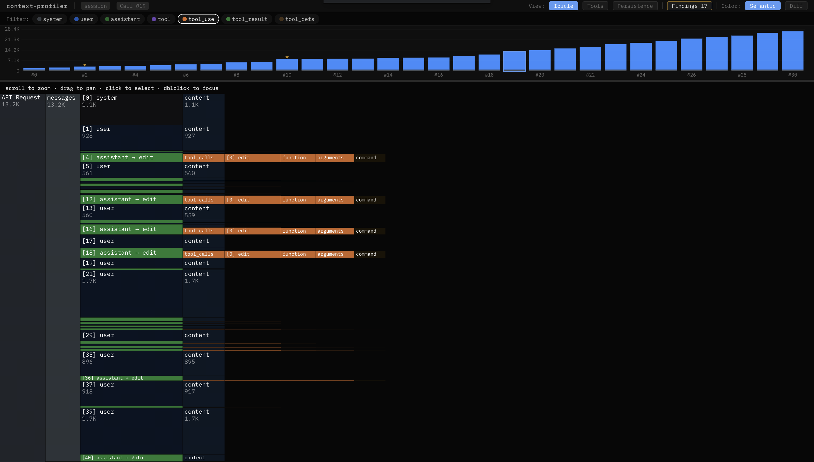
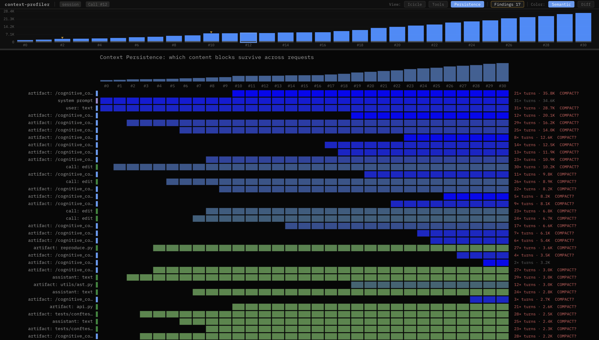
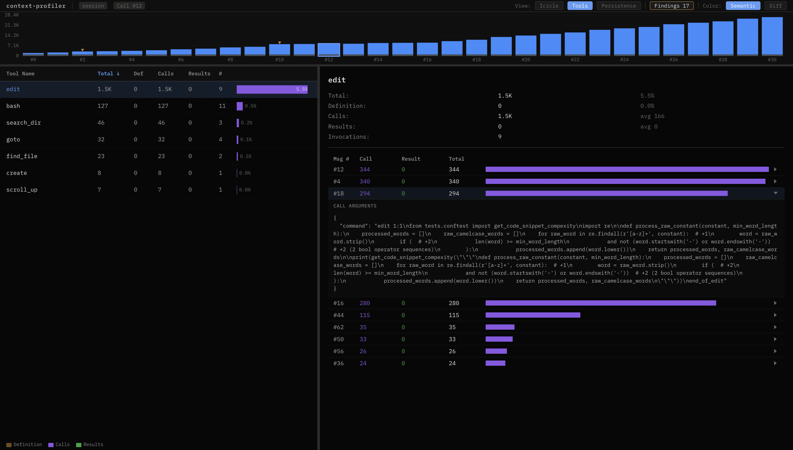
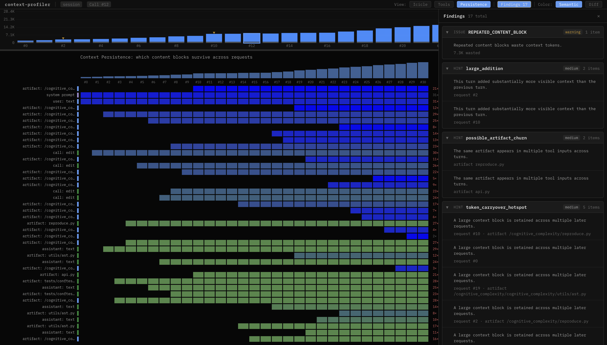

# context-profiler

[](https://pypi.org/project/context-profiler/)
[](https://pypi.org/project/context-profiler/)
[](https://opensource.org/licenses/MIT)

The evidence layer for context engineering. Profile before you prune.

`context-profiler` analyzes how context grows, repeats, and concentrates across agent turns — so you know **what** to compact and **where** it's safe to cut.

<p align="center">
  
</p>

## Two interfaces, one workflow

```
trace → diagnose (agent) → report (human) → prune/compact decision
```

- **`diagnose --json`** — stable issue codes and evidence for agents to act on automatically
- **`analyze --html`** — interactive report for humans to review before cutting

## Install

```bash
pipx install context-profiler
# or: uv tool install context-profiler
```

## Quick Start

```bash
# Generate an interactive HTML report
context-profiler analyze examples/swe_agent/session.jsonl --format openai --html report.html

# Get machine-readable diagnosis for agent consumption
context-profiler diagnose trace.json --format auto --json
```

## Report Views

<table>
  <tr>
    <td width="50%">
      
      <br><strong>Icicle</strong> — token distribution per request, diff mode for additions/removals
    </td>
    <td width="50%">
      
      <br><strong>Persistence</strong> — what survives across turns. Red = compact candidate
    </td>
  </tr>
  <tr>
    <td width="50%">
      
      <br><strong>Tools</strong> — which tools dominate the context budget
    </td>
    <td width="50%">
      
      <br><strong>Findings</strong> — issue codes with evidence and recommendations
    </td>
  </tr>
</table>

## Agent Harness

Agents use the CLI to discover formats, validate input, and get structured diagnosis:

```bash
context-profiler formats list --json          # discover supported formats
context-profiler validate trace.json --json   # check before analyzing
context-profiler diagnose trace.json --json   # structured issues + evidence
```

Example diagnosis output:

```json
{
  "issues": [
    {
      "code": "TOOL_INPUT_BLOAT",
      "severity": "critical",
      "message": "Tool inputs (not results) consume a large share of context.",
      "evidence": { "tool_input_tokens": 595, "ratio": 0.752 },
      "recommendation": "Consider using artifact references or shorter identifiers."
    }
  ]
}
```

Issue codes: `TOOL_INPUT_BLOAT`, `TOOL_RESULT_DOMINATES`, `TOP_TOOL_CONTEXT_HOTSPOT`, `REPEATED_CONTENT_BLOCK`, `REPEATED_TOOL_INPUT`, `STATIC_CONTEXT_BLOAT`

This repo also ships an [`analyze-agent-context`](skills/analyze-agent-context/SKILL.md) skill for Cursor, Claude Code, and Open Plugins compatible tools.

## Supported Inputs

| Kind | Formats | Confidence |
|------|---------|------------|
| Provider request | OpenAI, Anthropic | exact |
| Observability trace | Langfuse | high |
| Agent transcript | Cursor JSONL, Claude Code JSONL | partial |
| Benchmark trajectory | agent-trace, SWE-agent | dataset-dependent |

## Findings on Public Datasets

| Dataset | Turns | Redundancy | Top Issue | Carryover |
|---------|-------|------------|-----------|-----------|
| [SWE-agent](https://huggingface.co/datasets/nebius/SWE-agent-trajectories) | 31 | 26.9% | `REPEATED_CONTENT_BLOCK` | 231K across 20 blocks |
| [lmcache](https://huggingface.co/datasets/sammshen/lmcache-agentic-traces) | 35 | 1.4% | `REPEATED_CONTENT_BLOCK` | 403K across 20 blocks |
| [OpenHands](https://huggingface.co/datasets/nvidia/SWE-Zero-openhands-trajectories) | 34 | 0.2% | `REPEATED_CONTENT_BLOCK` | 383K across 20 blocks |

All examples included in [`examples/`](examples/) with conversion scripts.

## Development

```bash
git clone https://github.com/yanpgwang/context-profiler.git
cd context-profiler
PYTHONPATH=src uv run --with pytest pytest tests/ -v
```

## Docs

- [CLI harness design](docs/design/cli-harness.md)
- [Roadmap](docs/roadmap.md)
- [Examples](examples/README.md)

## Acknowledgements

Inspired by [context-lens](https://github.com/larsderidder/context-lens), [ContextFlame](https://github.com/jcgs2503/contextflame), and [speedscope](https://www.speedscope.app/).

## License

[MIT](LICENSE)
