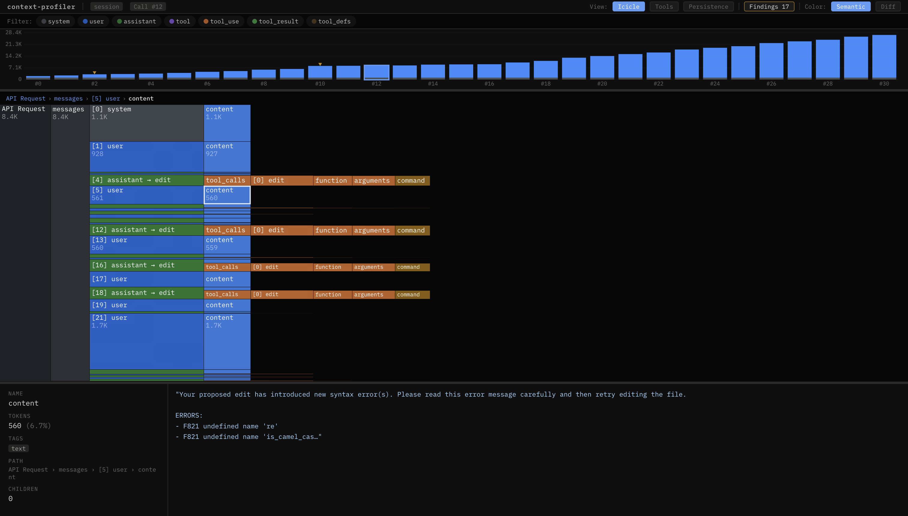

# context-profiler

[](https://pypi.org/project/context-profiler/)
[](https://pypi.org/project/context-profiler/)
[](https://opensource.org/licenses/MIT)

The evidence layer for context engineering. Profile before you prune.

`context-profiler` turns raw provider requests, observability exports, and agent trajectories into evidence about how context grows, repeats, and concentrates — so you know **what** to compact and **where** it's safe to cut.

<p align="center">
  
</p>

## Why

Compression tools (LLMLingua, `/compact`, Mem0) execute blindly. They don't tell you what's redundant, what's safe to remove, or what downstream references will break. `context-profiler` fills the missing step:

```
trace → profile → human review → prune/compact decision
```

Built for both humans and agents:
- **HTML reports** — interactive timeline, icicle, persistence heatmap, tools, diff, findings
- **JSON contracts** — stable issue codes and evidence for automated agent workflows
- **Trace-source agnostic** — same analysis across OpenAI, Anthropic, Langfuse, and public trajectory datasets

## Report Views

<table>
  <tr>
    <td width="50%">
      
      <br>
      <strong>Icicle</strong>
      <br>
      Token distribution per request. Semantic color by role, diff mode for additions/removals.
    </td>
    <td width="50%">
      
      <br>
      <strong>Persistence</strong>
      <br>
      Which content blocks survive across turns. Blue = token cost. Red = compact candidate.
    </td>
  </tr>
  <tr>
    <td width="50%">
      
      <br>
      <strong>Tools</strong>
      <br>
      Which tools dominate the context budget and their invocation details.
    </td>
    <td width="50%">
      
      <br>
      <strong>Findings</strong>
      <br>
      Issue codes with severity, evidence, and actionable recommendations.
    </td>
  </tr>
</table>

## Findings Across Public Datasets

Profiled on real multi-turn agent trajectories from public benchmarks:

| Dataset | Domain | Turns | Total Tokens | Redundancy | Top Issue | Carryover |
|---------|--------|-------|-------------|------------|-----------|-----------|
| [SWE-agent](https://huggingface.co/datasets/nebius/SWE-agent-trajectories) | Coding agent | 31 | 27.1K | 26.9% | `REPEATED_CONTENT_BLOCK` | 231K across 20 blocks |
| [lmcache](https://huggingface.co/datasets/sammshen/lmcache-agentic-traces) | KV-cache traces | 35 | 36.5K | 1.4% | `REPEATED_CONTENT_BLOCK` | 403K across 20 blocks |
| [OpenHands](https://huggingface.co/datasets/nvidia/SWE-Zero-openhands-trajectories) | Tool-heavy agent | 34 | 23.9K | 0.2% | `REPEATED_CONTENT_BLOCK` | 383K across 20 blocks |

All examples are included in [`examples/`](examples/) with conversion scripts and pre-converted session files.

## Install

For agent/CLI use, prefer an isolated executable install:

```bash
pipx install context-profiler
# or
uv tool install context-profiler
context-profiler --version
which -a context-profiler  # ensure a stale executable is not shadowing pipx/uv
```

Or install from source:

```bash
git clone https://github.com/Turdot/context-profiler.git
cd context-profiler
uv tool install -e .
# for local development in this repo:
PYTHONPATH=src uv run context-profiler --version
```

## Quick Start

Analyze a multi-turn agent session (SWE-agent trajectory included):

```bash
context-profiler analyze examples/swe_agent/session.jsonl --format openai --html report.html
```

Analyze a raw provider request:

```bash
context-profiler analyze request.json --format auto
context-profiler diagnose request.json --format auto --json
```

Analyze a Langfuse export:

```bash
context-profiler validate trace.json --format langfuse --json
context-profiler diagnose trace.json --format langfuse --json
context-profiler analyze trace.json --format langfuse --html report.html
```

Fetch a Langfuse trace through the public API, then analyze it:

```bash
TRACE_ID="<trace-id>"
HOST="${LANGFUSE_HOST%/}"
OUT="/tmp/langfuse-trace-${TRACE_ID}"
mkdir -p "$OUT"

curl -fsS \
  -u "$LANGFUSE_PUBLIC_KEY:$LANGFUSE_SECRET_KEY" \
  "$HOST/api/public/traces/$TRACE_ID" \
  -o "$OUT/trace.json"

curl -fsS \
  -u "$LANGFUSE_PUBLIC_KEY:$LANGFUSE_SECRET_KEY" \
  "$HOST/api/public/observations?traceId=$TRACE_ID&limit=100&page=1" \
  -o "$OUT/observations-page-1.json"

context-profiler diagnose "$OUT/trace.json" --format langfuse --json
```

Analyze a public academic agent trajectory:

```bash
context-profiler diagnose examples/agent-trace/sample.json --format agent-trace --json
context-profiler analyze examples/agent-trace/sample.json --format agent-trace --html report.html
```

Generate an interactive report:

```bash
context-profiler analyze session.jsonl --html report.html
```

## CLI Output

The terminal report gives a quick read on context budget, repeated content, and tool hotspots before you open the HTML report.

```text
╭──────────────────────────────────────────────────────────────────────────────╮
│ context-profiler  |  mode: snapshot  |  source:                              │
│ tests/fixtures/repeated_tool_calls.json                                      │
╰──────────────────────────────────────────────────────────────────────────────╯

⚠ Warnings
  • Content duplication: 476 redundant tokens (60.2% of total)

Token Distribution
  Category                  Tokens    % of Total
  Total Input                  791          100%
    System Prompt               13          1.6%
    Tool Definitions            83         10.5%
    Messages (assistant)       609         77.0%
    Messages (tool)             70          8.8%
    Messages (user)             16          2.0%

  Top Tools by Token Usage
      generate_canvas_component    595    75.2%
```

## Agent-Friendly CLI Harness

`context-profiler` is strict about supported formats but helpful when input does not match. Agents can discover contracts and adapt unsupported traces without asking users to reshape data manually.

```bash
# Discover supported formats
context-profiler formats list --json
context-profiler formats describe cursor-jsonl --json

# Discover canonical contracts
context-profiler schema trace --json
context-profiler schema diagnosis --json

# Validate and normalize
context-profiler validate trace.json --format auto --json
context-profiler normalize trace.json --from auto --json

# Diagnose for agent consumption; '-' reads JSON/JSONL from stdin
context-profiler diagnose trace.json --format auto --json
```

If validation fails, the JSON response includes `errors[].agent_action` and `next_steps` so the agent can convert the trace into `ContextTrace`.

## Agent Skill Distribution

This repository ships an `analyze-agent-context` skill for Cursor, Claude Code, and other Agent Skills / Open Plugins compatible tools.

The skill does not make `context-profiler` fetch traces itself. It teaches agents to fetch Langfuse trace ids with the Langfuse public API via `curl`, then route the fetched JSON into `context-profiler` for diagnosis whenever the user asks to analyze a trace, loop, transcript, agent run, context growth, stale context, or tool bloat. It intentionally avoids `langfuse-cli` for trace fetching because the CLI may omit fields needed for complete analysis.

Canonical skill:

```text
skills/analyze-agent-context/SKILL.md
```

Plugin manifests:

```text
.plugin/plugin.json
.claude-plugin/marketplace.json
```

## Supported Inputs

Use `context-profiler formats list --json` for the current machine-readable registry.

| Kind | Formats | Confidence |
|------|---------|------------|
| Provider request | OpenAI, Anthropic | exact |
| Observability trace | Langfuse, planned OTel/OpenInference | high |
| Agent transcript | Cursor JSONL, Claude Code JSONL | partial |
| Benchmark trajectory | planned agent-trace, agent_trajectories, SWE-agent | dataset-dependent |

For `agent-transcript`, analysis is intentionally marked `partial`: hidden system prompts, rules, tool definitions, MCP schemas, and provider compaction may not be present.

## Example Diagnosis

```json
{
  "issues": [
    {
      "code": "TOOL_USE_DOMINATES_CONTEXT",
      "severity": "critical",
      "message": "Tool inputs dominate the visible context."
    },
    {
      "code": "TOP_TOOL_CONTEXT_HOTSPOT",
      "message": "ApplyPatch is the largest visible tool context hotspot."
    }
  ],
  "diff_hints": [
    {
      "type": "large_addition",
      "request_index": 76,
      "evidence": {
        "added_tokens": 7473,
        "top_added_tool": "ApplyPatch"
      }
    }
  ]
}
```

Academic trajectory sample:

```text
context-profiler analyze examples/agent-trace/sample.json --format agent-trace --html report.html

Total Input: 11.7K
Messages (assistant): 10.7K
Tool: python_interpreter 2.9K
Warnings: Content duplication 2.3K redundant tokens
```

## Examples

See [`examples/README.md`](examples/README.md) for runnable fixtures and conversion patterns.

Recommended demo order:

1. Raw OpenAI/Anthropic request.
2. Cursor or Claude Code transcript.
3. Langfuse trace export.
4. Multi-turn academic trajectories such as `pagarsky/agent-trace`, `cx-cmu/agent_trajectories`, or SWE-agent traces.

## Research Context

`context-profiler` is motivated by recent work showing that long-horizon agents are constrained not only by model quality, but also by how their working context is retained, compressed, and reused across turns.

Related work:

- **ByteDance Seed — _Scaling Long-Horizon LLM Agent via Context-Folding_**  
  Studies context management for long-horizon agents through folding and summarizing intermediate sub-trajectories. This motivates `context-profiler`'s focus on turn-to-turn context diffs, retained observations, and compression/pruning evidence.
- **SWE-agent — _Agent-Computer Interfaces Enable Automated Software Engineering_**  
  Shows the importance of the agent-computer interface for software-engineering agents, motivating analysis of tool calls, terminal output, and artifact churn.
- **WebArena — _A Realistic Web Environment for Building Autonomous Agents_**  
  Demonstrates the value of realistic multi-step agent trajectories, motivating support for loop/transcript analysis rather than only single prompt snapshots.

## Docs

- [CLI harness design](docs/design/cli-harness.md)
- [Roadmap](docs/roadmap.md)

## What It Does Not Do

- It does not fetch traces from Langfuse, Hugging Face, Cursor, or Claude Code.
- It does not replay agent loops.
- It does not execute tools.
- It does not replace observability platforms.
- It does not pretend agent transcripts are exact raw provider requests.

## Development

```bash
PYTHONPATH=src uv run --with pytest pytest tests/test_smoke.py -v
```

## Acknowledgements

This project is inspired by and learned from:

- [context-lens](https://github.com/larsderidder/context-lens) — local proxy for capturing and visualizing LLM API calls
- [ContextFlame](https://github.com/jcgs2503/contextflame) — flamegraph-based token profiling for Claude Code
- [speedscope](https://www.speedscope.app/) — the icicle / flamegraph UI design is inspired by speedscope's interactive visualization

## License

[MIT](LICENSE)
