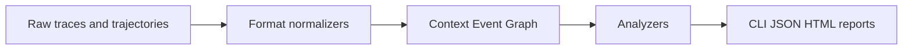

# context-profiler CLI Harness 设计

## 背景

`context-profiler` 当前已经能分析 LLM agent 请求中的 token 分布、tool definitions、message history 和 HTML 可视化。`update_component_ce` 进一步证明：从真实 agent trace 中识别 stale content、verbose tool output、重复字段和历史上下文污染后，通过 context engineering 可以带来可量化收益。

下一步不是把项目局限成 `update_component` 专用分析器，而是从这个 case study 生长出一个通用开源项目：面向 Cursor、Claude Code、Langfuse、OpenTelemetry、学术 trajectory 数据集和各种 agent framework 的 context analysis harness。

目标定位：

> Bring your traces. We normalize them. Then we diagnose context evolution.

## 设计原则

### 1. Agent-first CLI

CLI 首先要让 Cursor / Claude Code / Codex 这类 agent 容易使用，而不是只让人类读文档后手动操作。

核心要求：

- 可发现：agent 能通过命令理解支持哪些格式、输入 schema 是什么。
- 可验证：输入不对时返回结构化错误，而不是模糊失败。
- 可组合：支持 stdin/stdout，方便 agent 从任意外部工具获取数据后 pipe 进来。
- 机器可读：所有核心命令支持 `--json`。
- 人类友好：默认 CLI 输出可读，复杂结果可生成 HTML report。

### 2. 不强迫用户适配我们的外部格式

不要要求用户先把 Langfuse、HuggingFace、Claude Code transcript、OpenTelemetry spans 转成某个私有 JSON。

正确方式是：

- 外部世界可以是任意 trace / transcript / span / trajectory 格式。
- CLI 暴露 canonical schema 和 adapter 描述。
- agent 或轻量 adapter 负责把外部数据 normalize 到内部模型。
- 分析器只依赖统一的 Context Event Graph。

### 3. 分析优先，不做 benchmark runner

第一阶段聚焦 context analysis，不做模型回放、环境执行、leaderboard 或 benchmark runner。

允许读取公开 academic trajectory 文件，是为了做可复现分析和论文叙事，不是为了一开始做打榜平台。

## CLI 风格参考

### Langfuse CLI

Langfuse CLI 的核心价值是 agent 可发现：

```bash
langfuse api __schema
langfuse api <resource> --help
langfuse api <resource> <action> --help
langfuse api <resource> <action> --json
langfuse api <resource> <action> --curl
```

它把完整 API 映射成 CLI，并通过 schema/help/JSON 输出让 agent 可以自动调用。

### kubectl

`kubectl` 的启发是资源模型和解释能力：

```bash
kubectl get ... -o json
kubectl describe ...
kubectl explain ...
```

对我们来说，对应的是 `formats describe`、`schema`、`analyze`、`diagnose`。

### Terraform

Terraform 的启发是验证和机器输出：

```bash
terraform validate -json
terraform plan -json
terraform show -json
```

对我们来说，对应的是 `validate --json`、稳定 JSON report、版本化 schema。

### gh

GitHub CLI 的启发是：人类命令和 API escape hatch 共存。

```bash
gh pr list --json ...
gh api ...
```

对我们来说，对应的是：默认命令服务常见分析，底层 `schema` / `formats` / `normalize` 给 agent 细粒度控制。

### Repomix

Repomix 的启发是 AI context 工具需要同时支持 CLI 输出、JSON 输出和 MCP server。

第一阶段先做好 CLI，后续可以补 MCP server。

## 推荐 CLI 入口

### 格式发现

```bash
context-profiler formats list
context-profiler formats describe <format> --json
```

用途：

- 列出支持的 raw formats。
- 解释某个 format 的必要字段、可选字段、自动检测规则和 normalize 输出。

初始 formats：

- `openai`
- `anthropic`
- `langfuse`
- `otel`
- `openinference`
- `claude-code-jsonl`
- `cursor-jsonl`
- `agent-trace`
- `agent-trajectories`
- `swe-agent-traj`
- `generic-messages`
- `context-trace`

### Schema 发现

```bash
context-profiler schema trace --json
context-profiler schema diagnosis --json
```

用途：

- `trace`：输出 canonical Context Trace schema。
- `diagnosis`：输出 agent-readable diagnosis report schema。

这相当于 Langfuse 的 `__schema` 和 AWS 的 `--generate-cli-skeleton`。

### 输入验证

```bash
context-profiler validate <file|-> --format auto --json
```

用途：

- 检查输入是否是 canonical trace。
- 如果不是，尝试识别 raw format。
- 返回可执行错误，例如缺失字段、无法识别 tool result、timestamp 不合法、span parent 缺失。

### 格式归一化

```bash
context-profiler normalize <file|-> --from <format|auto> --json
```

用途：

- 把 raw trace 转成 canonical Context Trace。
- 方便 agent 在正式分析前调试转换。
- `analyze` 和 `diagnose` 内部也可以自动 normalize，所以用户不一定需要显式调用。

### 基础分析

```bash
context-profiler analyze <file|-> --format auto
context-profiler analyze <file|-> --format auto --json
context-profiler analyze <file|-> --format auto --html report.html
```

用途：

- 给人看 token distribution、timeline、static/dynamic growth、tool usage。
- 给 agent 返回结构化 metrics。
- 生成 HTML report。

### 诊断

```bash
context-profiler diagnose <file|-> --format auto --json
```

用途：

- 给 agent 一个稳定、可解释的 context pathology report。
- 输出 issue codes、severity、evidence、recommendation。

示例 issue codes：

- `STATIC_CONTEXT_BLOAT`
- `DYNAMIC_HISTORY_GROWTH`
- `REPEATED_TOOL_INPUT`
- `VERBOSE_TOOL_OUTPUT`
- `REPEATED_CONTENT_BLOCK`
- `STALE_CONTENT`
- `SUPERSEDED_CONTEXT`
- `ORPHANED_CONTEXT`
- `PATCH_CHURN`
- `SUBAGENT_CONTEXT_LEAK`
- `CACHE_BUSTING_PREFIX`

## 内部核心模型：Context Event Graph

所有输入最终 normalize 到一个内部图模型。



核心实体：

- `Run`：一次 agent 任务、会话或 trajectory。
- `Turn`：用户/assistant 交互轮次。
- `Span`：LLM call、tool call、retrieval、subagent、handoff、environment step。
- `Message`：role、content、tool use、tool result。
- `Artifact`：文件、patch、DOM snapshot、terminal output、component、observation。
- `ContentBlock`：可 hash、diff、embedding、版本追踪的最小分析块。
- `Edge`：内容之间的关系。

核心边类型：

- `repeats`：重复出现。
- `modifies`：修改同一 artifact。
- `supersedes`：新内容覆盖旧内容。
- `references`：后续内容引用前序内容。
- `contradicts`：新旧内容冲突。
- `orphaned`：仍在上下文中但后续未被使用。
- `leaks_into`：subagent/tool output 把大块内容带回主上下文。

## 第一阶段分析能力

### Static vs Dynamic Growth

分析稳定上下文和动态上下文如何增长：

- system prompt tokens
- rules / skills tokens
- tool definitions tokens
- message history tokens
- tool result tokens
- per-turn growth
- prefix cache 友好程度
- timestamp/session id 是否破坏 stable prefix

### Tool Input / Output Pathology

扩展当前已有 tool analyzer：

- tool definition token 热点。
- 未调用但占用大量 token 的 tools。
- repeated tool input field。
- verbose tool output。
- tool output 是否适合替换为 artifact reference。
- tool result 是否持续污染后续 context。

### Repeated Modification Graph

针对同一内容反复修改：

- 同一文件、组件、patch、DOM snapshot 被修改多少轮。
- 每轮 diff 大小。
- 是否出现 patch churn：大量 token 花在小幅反复改动。
- 是否存在旧版本 artifact 继续影响后续结果。

### Stale / Superseded / Orphaned Context

分析内容生命周期：

- 哪些内容被后续内容覆盖。
- 哪些旧内容仍在 context 中但已不再 relevant。
- 哪些 tool failures / failed patches / old requirements 继续被引用。
- 哪些大块内容从未被后续使用。

### Subagent Context Analysis

如果 trace 里存在 subagent 或 handoff：

- subagent brief 大小。
- subagent 返回内容大小。
- 返回内容中有多少被主 agent 使用。
- 多个 subagents 是否重复分析同一批内容。
- subagent 是否真的减少主 context 膨胀。

## 支持的数据来源

第一阶段支持的是“格式兼容”，不是“数据源客户端”。

优先 formats：

- OpenAI / Anthropic raw request JSON。
- Langfuse exported trace / observations JSON。
- OpenTelemetry / OpenInference spans。
- Claude Code-style JSONL transcript。
- Cursor-style JSONL transcript。
- Multi-turn academic agent traces, especially `agent-trace`、`agent_trajectories`、SWE-agent trajectories。
- Generic messages + tool calls JSON。

后续可以通过 skills 教 agent 如何获取这些数据：

- Langfuse：用 `langfuse-cli` 拉 trace。
- HuggingFace dataset：agent 用 Python 或 HF CLI 下载样本，再 pipe 给 `context-profiler`。
- Claude Code：agent 找本地 JSONL transcript。
- Cursor：agent 使用可访问的 session/export 文件。

## 明确不做

第一阶段不做：

- 不做 benchmark runner。
- 不做 leaderboard。
- 不做 agent loop replay。
- 不重新执行 tool calls。
- 不要求用户上传数据到云端。
- 不把所有第三方数据源都做成内置 fetch client。

## 推荐实现顺序

1. 定义 `ContextTrace` 和 `DiagnosisReport` schema。
2. 增加 `formats list`、`formats describe`、`schema`。
3. 增加 `validate`。
4. 增加 `normalize` 和 adapter interface。
5. 迁移现有 OpenAI / Anthropic / Langfuse 解析为 normalizer。
6. 把 `content_repeat`、`field_repeat` 挂入 analyzer pipeline。
7. 增加 static/dynamic growth analyzer。
8. 增加 tool IO pathology analyzer。
9. 增加 repeated modification / stale context 的第一版 graph analyzer。
10. 输出 agent-readable `diagnose --json`。
11. 更新 README，写 Cursor / Claude Code 使用方式。
12. 后续增加 skills 和 MCP server。

## 成功标准

短期成功标准：

- 用户可以把 Langfuse trace、Claude/Cursor-style JSONL 或 raw OpenAI/Anthropic request 直接交给 CLI；agent 可以把公开 multi-turn trajectory 归一化后交给 CLI。
- CLI 可以自动识别或给出明确验证错误。
- `diagnose --json` 能输出 agent 可引用的问题列表和 evidence。
- HTML report 能展示 static/dynamic growth、tool bloat、重复内容、stale/superseded content。

长期成功标准：

- 当开发者想理解 agent context 为什么膨胀、污染、变旧、反复修改时，第一个想到 `context-profiler`。
- Cursor / Claude Code 可以通过 skill 自动调用 `context-profiler` 分析任意 trace。
- 学术用户可以用公开 trajectory 数据集做可复现的 context pathology analysis。
